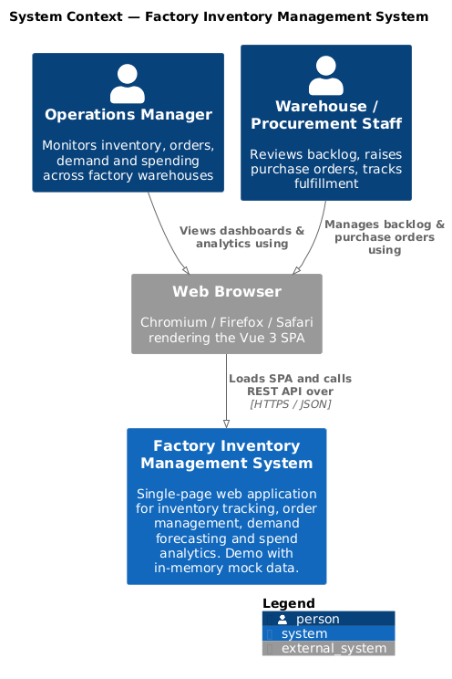
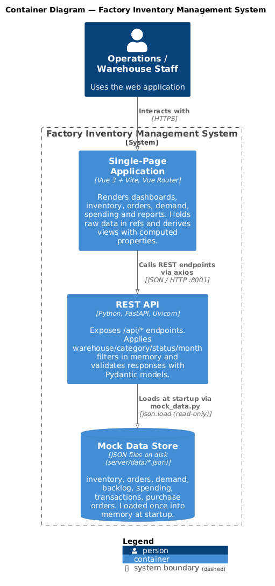
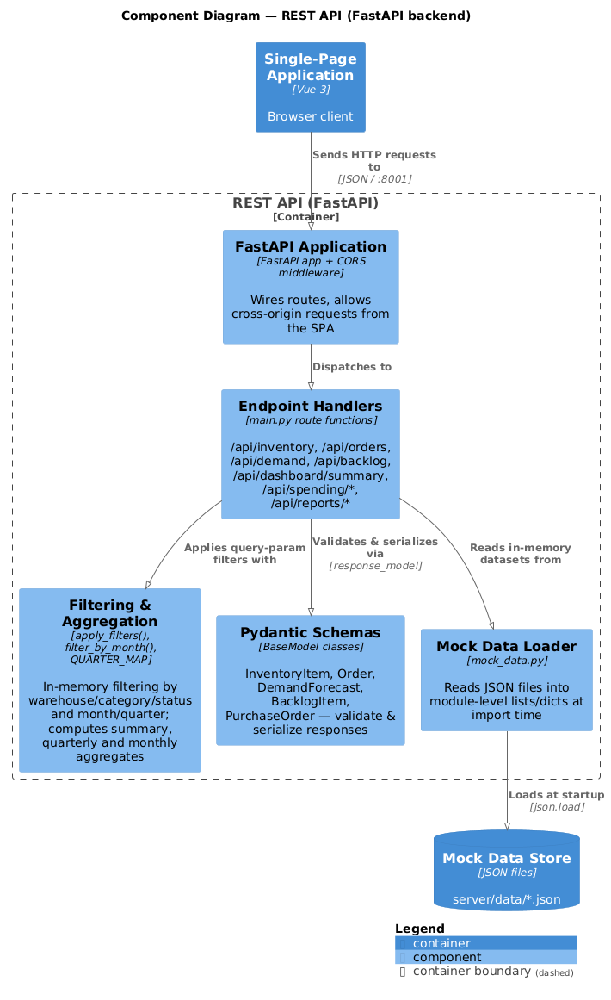
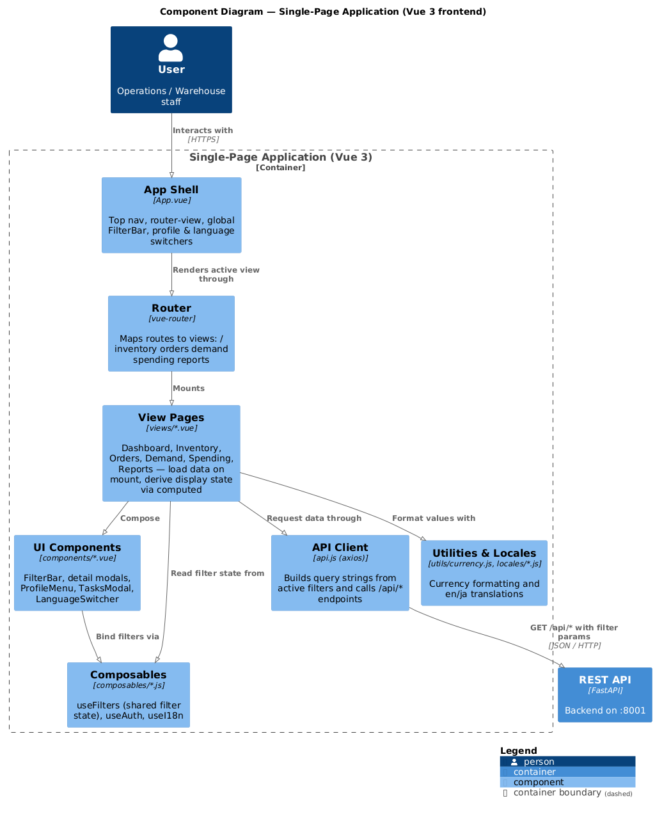
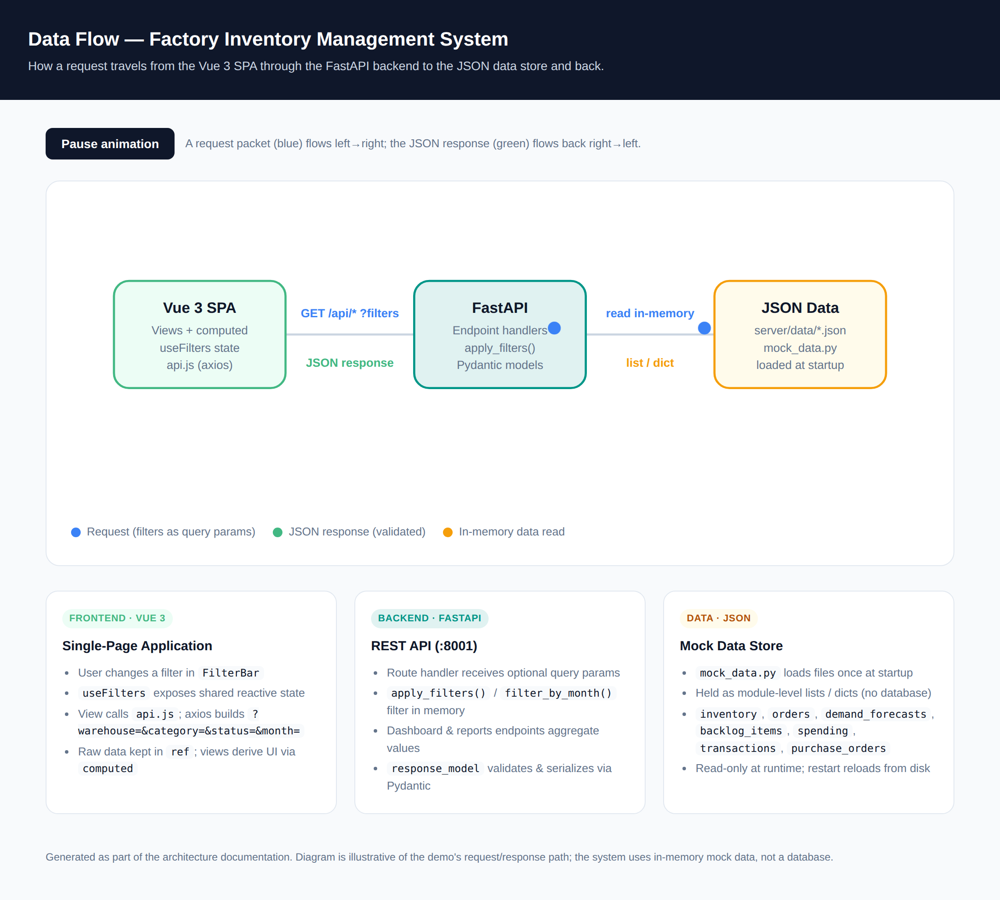

# Architecture — Factory Inventory Management System

This document describes the architecture of the Factory Inventory Management System,
a full-stack demo application for inventory tracking, order management, demand
forecasting and spend analytics.

It uses the [C4 model](https://c4model.com/) (Context, Container, Component) to
describe the system at progressively finer levels of detail, plus an interactive
data-flow view of the request lifecycle.

- **Frontend**: Vue 3 (Composition API) + Vite + Vue Router — port `3000`
- **Backend**: Python + FastAPI + Uvicorn — port `8001`
- **Data**: In-memory mock data loaded from JSON files (`server/data/*.json`) — no database

---

## Table of contents

1. [C4 Level 1 — System Context](#c4-level-1--system-context)
2. [C4 Level 2 — Containers](#c4-level-2--containers)
3. [C4 Level 3 — Components](#c4-level-3--components)
4. [Request data flow](#request-data-flow)
5. [Technology stack](#technology-stack)
6. [Key architectural decisions](#key-architectural-decisions)
7. [Regenerating the diagrams](#regenerating-the-diagrams)

---

## C4 Level 1 — System Context

The system is a single-page web application used by operations and warehouse
staff. The browser loads the SPA and talks to the backend over a JSON REST API.



Source: [`c4-01-context.puml`](c4-01-context.puml)

---

## C4 Level 2 — Containers

Three deployable/runtime units make up the system:

| Container | Technology | Responsibility |
|-----------|------------|----------------|
| **Single-Page Application** | Vue 3, Vite, Vue Router | Renders all views; holds raw data in `ref`s and derives display data via `computed` properties |
| **REST API** | Python, FastAPI, Uvicorn | Exposes `/api/*` endpoints, applies filters in memory, validates responses with Pydantic |
| **Mock Data Store** | JSON files on disk | Source data loaded once into memory at startup; read-only at runtime |



Source: [`c4-02-container.puml`](c4-02-container.puml)

---

## C4 Level 3 — Components

### Backend — REST API (FastAPI)

The backend is intentionally small: a single `main.py` wires routes that read from
in-memory datasets, filter/aggregate them, and serialize the result through Pydantic
models.



Source: [`c4-03-component-backend.puml`](c4-03-component-backend.puml)

| Component | Where | Responsibility |
|-----------|-------|----------------|
| FastAPI Application | `server/main.py` | App instance + CORS middleware (`allow_origins=["*"]` for dev) |
| Endpoint Handlers | `server/main.py` | `/api/inventory`, `/api/orders`, `/api/demand`, `/api/backlog`, `/api/dashboard/summary`, `/api/spending/*`, `/api/reports/*` |
| Filtering & Aggregation | `apply_filters()`, `filter_by_month()`, `QUARTER_MAP` | In-memory filtering by warehouse/category/status and month/quarter; summary, quarterly and monthly aggregates |
| Pydantic Schemas | `server/main.py` | `InventoryItem`, `Order`, `DemandForecast`, `BacklogItem`, `PurchaseOrder` validate and serialize responses |
| Mock Data Loader | `server/mock_data.py` | Reads JSON files into module-level lists/dicts at import time |

### Frontend — Single-Page Application (Vue 3)

The SPA follows a "views compose components, components read shared state from
composables" structure. All HTTP access is centralized in `api.js`.



Source: [`c4-04-component-frontend.puml`](c4-04-component-frontend.puml)

| Component | Where | Responsibility |
|-----------|-------|----------------|
| App Shell | `App.vue` | Top nav, `router-view`, global `FilterBar`, profile & language switchers |
| Router | `main.js` (vue-router) | Maps routes to views: `/`, `/inventory`, `/orders`, `/demand`, `/spending`, `/reports` |
| View Pages | `views/*.vue` | Dashboard, Inventory, Orders, Demand, Spending, Reports — load data on mount, derive state via `computed` |
| UI Components | `components/*.vue` | `FilterBar`, detail modals, `ProfileMenu`, `TasksModal`, `LanguageSwitcher` |
| Composables | `composables/*.js` | `useFilters` (shared filter state), `useAuth`, `useI18n` |
| API Client | `api.js` | Builds query strings from active filters and calls `/api/*` via axios |
| Utilities & Locales | `utils/currency.js`, `locales/*.js` | Currency formatting and en/ja translations |

---

## Request data flow

A request originates from a filter change in the SPA, travels to the API as query
parameters, is filtered in memory against the JSON-sourced datasets, and returns a
validated JSON response that the views render via computed properties.



An **interactive** version is available — open [`data-flow.html`](data-flow.html)
in a browser to see the animated request/response packets:

```
Vue 3 SPA  ──GET /api/* ?warehouse&category&status&month──▶  FastAPI  ──read──▶  JSON files
   ▲                                                            │
   └──────────────── validated JSON response ◀──────────────────┘
```

**Step by step:**

1. A user changes a filter in `FilterBar`; `useFilters` updates shared reactive state.
2. The active view calls `api.js`; axios serializes filters into the query string,
   skipping any value equal to `all`.
3. The FastAPI handler receives the optional query params and calls
   `apply_filters()` / `filter_by_month()` to filter the in-memory dataset.
4. Dashboard and report endpoints additionally aggregate values (totals, fulfillment
   rate, month/quarter rollups).
5. The response is validated and serialized through a Pydantic `response_model`.
6. The view stores the raw result in a `ref` and derives display data with `computed`
   properties.

---

## Technology stack

| Layer | Choice | Version (declared) |
|-------|--------|--------------------|
| UI framework | Vue 3 (Composition API) | `^3.4.21` |
| Router | Vue Router | `^4.3.0` |
| HTTP client | axios | `^1.6.7` |
| Build tool / dev server | Vite | `^5.2.0` |
| API framework | FastAPI | `>=0.110.0` |
| ASGI server | Uvicorn | `>=0.24.0` |
| Validation | Pydantic | `>=2.5.0` |
| Runtime | Python | `>=3.11` |
| Tests | pytest + FastAPI TestClient | `tests/backend/` |

---

## Key architectural decisions

- **In-memory mock data, no database.** Data lives in module-level Python structures
  loaded from JSON at startup. Reads are fast and the demo needs no persistence;
  the trade-off is that writes do not persist across restarts.
- **All filtering happens server-side, in Python.** The four cross-cutting filters
  (time period, warehouse, category, order status) are applied as query params so the
  same dataset powers every view consistently.
- **Raw data in refs, derived data in computed.** The frontend keeps API results in
  `ref`s and computes every displayed metric/chart from them, keeping reactivity
  predictable and cheap.
- **Centralized API client.** `api.js` is the single place that knows endpoint URLs
  and how filters become query parameters.
- **Pydantic as the contract.** `response_model` on each endpoint validates and
  documents the shape of every response (and powers the `/docs` OpenAPI UI).
- **Stateless, CORS-open dev backend.** `allow_origins=["*"]` suits local development;
  it must be restricted before any real deployment (see limitations below).

### Limitations (demo scope)

This is a demonstration application. It is **not** production-ready: there is no
authentication/authorization, no database or persistence, no rate limiting, and CORS
is fully open. Hardening these is required before any non-local use.

---

## Regenerating the diagrams

The C4 diagrams are written in [PlantUML](https://plantuml.com/) using the vendored
[C4-PlantUML](https://github.com/plantuml-stdlib/C4-PlantUML) v2.10.0 macros in
[`c4lib/`](c4lib/) (vendored so diagrams render offline and deterministically).

**Requirements:** Java 11+ and `plantuml.jar`.

```bash
cd docs/architecture

# Render every C4 diagram to PNG into diagrams/
java -jar plantuml.jar -tpng -o diagrams c4-*.puml

# (Optional) re-snapshot the interactive HTML data-flow page
# Open data-flow.html in a browser, or screenshot it headlessly.
```

The diagrams use the bundled **Smetana** layout engine
(`!pragma layout smetana`), so **Graphviz is not required**.

### Files in this directory

| File | Purpose |
|------|---------|
| `README.md` | This document |
| `c4-01-context.puml` | C4 L1 — System Context source |
| `c4-02-container.puml` | C4 L2 — Container source |
| `c4-03-component-backend.puml` | C4 L3 — Backend component source |
| `c4-04-component-frontend.puml` | C4 L3 — Frontend component source |
| `data-flow.html` | Interactive Vue → FastAPI → JSON data-flow page |
| `c4lib/` | Vendored C4-PlantUML v2.10.0 macros |
| `diagrams/*.png` | Rendered PNG output |
